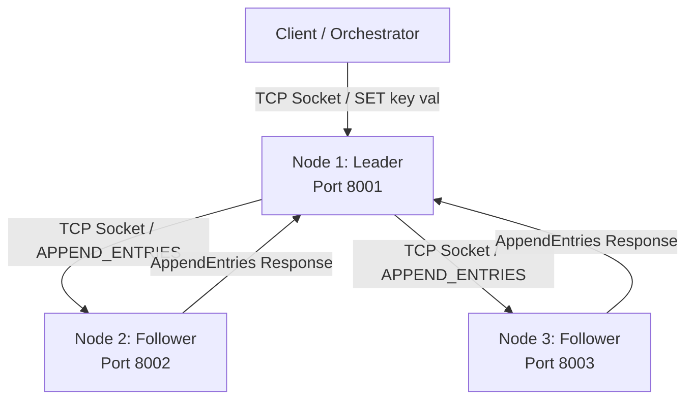
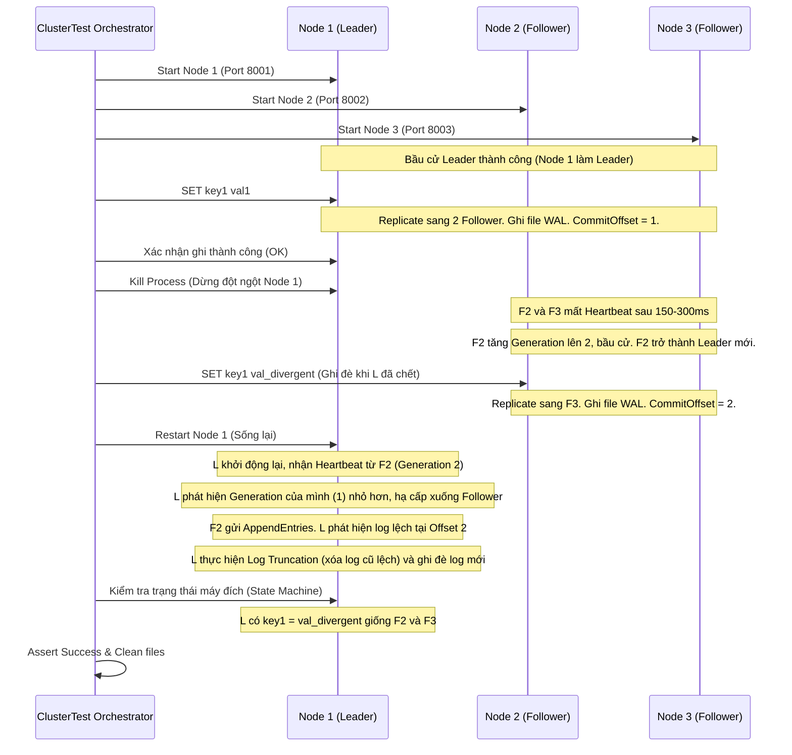

# Tài liệu thiết kế: Distributed Key-Value Store (Raft-like Consensus)

Tài liệu này đặc tả thiết kế kỹ thuật cho một hệ thống Lưu trữ Khóa - Giá trị Phân tán (Distributed Key-Value Store) thu nhỏ, mô phỏng các nguyên lý cốt lõi của Raft (Redis/etcd rút gọn) bao gồm: **Generation Clock (Generation)**, **High-Water Mark (Commit Offset)**, và **Replicated Log (WAL)**.

---

## 1. Kiến trúc tổng quan (Architecture Overview)

Hệ thống bao gồm một cụm (cluster) gồm 3 nút (Node) chạy trên môi trường `localhost` với các cổng TCP khác nhau (ví dụ: `8001`, `8002`, `8003`).



*   **Không sử dụng**: gRPC, Akka, Spring Cloud, Netty, SQLite/Redis hay bất kỳ database/RPC framework nào có sẵn.
*   **Sử dụng**: Raw TCP Sockets (`ServerSocket` và `Socket` trong Java), gói tin JSON truyền dưới dạng văn bản từng dòng (Line-oriented JSON), thư viện Jackson để parse JSON, và xử lý đa luồng thủ công.

---

## 2. Giao thức truyền thông (Protocol Specification)

Mỗi thông điệp truyền qua TCP Socket là một chuỗi JSON trên một dòng độc lập, kết thúc bằng ký tự xuống dòng `\n`. Điều này cho phép đọc bằng `BufferedReader.readLine()`.

### 2.1. Node-to-Node Messages

#### A. Heartbeat / AppendEntries
Leader gửi thông điệp này định kỳ (Heartbeat - 50ms) hoặc khi có dữ liệu ghi mới cần replication.
```json
{
  "type": "APPEND_ENTRIES",
  "generation": 1,
  "leaderId": 1,
  "prevLogOffset": 3,
  "prevLogGeneration": 1,
  "entries": [
    {
      "offset": 4,
      "generation": 1,
      "cmd": "SET age 25"
    }
  ],
  "leaderCommitOffset": 3
}
```

#### B. AppendEntriesResponse
Follower gửi trả về sau khi nhận được `APPEND_ENTRIES`.
```json
{
  "type": "APPEND_ENTRIES_RESPONSE",
  "generation": 1,
  "success": true,
  "matchOffset": 4,
  "nodeId": 2
}
```

#### C. RequestVote
Candidate gửi đi khi bắt đầu cuộc bầu cử mới (Generation Clock tăng thêm 1).
```json
{
  "type": "REQUEST_VOTE",
  "generation": 2,
  "candidateId": 3,
  "lastLogOffset": 4,
  "lastLogGeneration": 1
}
```

#### D. RequestVoteResponse
Nút nhận được `RequestVote` phản hồi chấp nhận hoặc từ chối bỏ phiếu.
```json
{
  "type": "REQUEST_VOTE_RESPONSE",
  "generation": 2,
  "voteGranted": true,
  "nodeId": 1
}
```

### 2.2. Client-to-Node Messages

#### A. Client Request
Gửi từ Client tới một nút bất kỳ trong cụm:
*   Ghi: `{"type":"SET", "key":"name", "value":"Antigravity"}`
*   Đọc: `{"type":"GET", "key":"name"}`

#### B. Client Response
*   Thành công (Write): `{"status":"OK"}`
*   Thành công (Read): `{"status":"VALUE", "value":"Antigravity"}`
*   Redirect (khi client kết nối tới Follower):
    `{"status":"REDIRECT", "leaderAddress":"127.0.0.1:8001"}`
*   Lỗi: `{"status":"ERROR", "message":"Reason description"}`

---

## 3. Thiết kế trạng thái nút (Node State & Lifecycle)

Mỗi nút có thể ở một trong ba trạng thái: **Follower**, **Candidate**, hoặc **Leader**.

### 3.1. Các biến trạng thái của một Nút
*   **Trạng thái bền vững (Persistent State)**:
    *   `currentGeneration` (Generation Clock): Kỳ bầu cử hiện tại (bắt đầu từ 0).
    *   `votedFor`: ID của candidate được nút này bỏ phiếu trong kỳ hiện tại (null nếu chưa bỏ phiếu).
    *   `log`: Danh sách các entry dạng `List<LogEntry>`. Mỗi entry có `offset`, `generation`, `cmd`.
*   **Trạng thái tạm thời (Volatile State - Tất cả các nút)**:
    *   `commitOffset` (High-Water Mark / commitOffset): Offset của entry cao nhất đã biết là được commit (bắt đầu từ 0).
    *   `lastApplied`: Offset của entry cao nhất đã được áp dụng vào State Machine (bắt đầu từ 0).
    *   `stateMachine`: Bản đồ khóa-giá trị trong bộ nhớ (`ConcurrentHashMap<String, String>`).
*   **Trạng thái tạm thời của Leader (Volatile State - Chỉ Leader)**:
    *   `nextOffset[]`: Offset của log entry tiếp theo sẽ gửi cho mỗi follower.
    *   `matchOffset[]`: Offset của log entry cao nhất đã biết là đã được replicate trên mỗi follower.

### 3.2. Quản lý thời gian (Timer & Heartbeat)
*   **Heartbeat Interval**: 50ms. Leader gửi định kỳ gói tin `APPEND_ENTRIES` trống.
*   **Election Timeout**: Ngẫu nhiên từ 150ms đến 300ms. Mỗi follower/candidate duy trì một timer. Nếu không nhận được heartbeat từ Leader trong khoảng này, nó sẽ tự động chuyển sang Candidate để tranh cử.

---

## 4. Ghi nhật ký (WAL) và Cắt log (Log Truncation)

### 4.1. Định dạng File WAL (`node_<id>_wal.log`)
Mỗi log entry được lưu trữ thành một dòng văn bản trong file log của từng nút để phục hồi khi khởi động lại:
```text
[offset] [generation] [cmd]
```
Ví dụ:
```text
1 1 SET a 10
2 1 SET b 20
3 2 SET a 15
```

Khi khởi động lại, nút sẽ đọc file WAL từ đầu đến cuối để xây dựng lại danh sách log trong bộ nhớ và áp dụng các lệnh đã commit vào `stateMachine`.

### 4.2. Cơ chế cắt log (Log Truncation)
Khi Follower nhận được `APPEND_ENTRIES` từ Leader:
1.  **Kiểm tra tính nhất quán**: Tìm kiếm trong log cục bộ xem có phần tử tại `prevLogOffset` trùng khớp với `prevLogGeneration` hay không.
    *   Nếu không tìm thấy, từ chối gói tin (`success: false`).
2.  **Cắt log khi có xung đột (Truncation)**: Nếu tại vị trí `prevLogOffset + 1` trở đi, có log cục bộ nhưng `generation` của log cục bộ khác với `generation` của entry mới từ Leader:
    *   Xóa toàn bộ các entry từ vị trí xung đột này tới cuối danh sách log trong bộ nhớ.
    *   Ghi đè hoặc cắt ngắn file WAL trên đĩa tương ứng (đọc lại file và ghi đè phần dữ liệu không bị xóa, hoặc ghi đè toàn bộ log mới khớp với bộ nhớ).
3.  **Ghi tiếp (Append)**: Lưu các entry mới nhận được từ Leader vào log cục bộ và ghi nối đuôi (append) vào file WAL.

---

## 5. Cơ chế Vạch nước cao (High-Water Mark / commitOffset)

Quy trình xử lý một lệnh ghi `SET key value`:

1.  Client gửi yêu cầu `SET` tới Leader.
2.  Leader tạo entry mới, lưu vào log cục bộ và ghi đĩa (WAL).
3.  Leader gửi yêu cầu `APPEND_ENTRIES` song song tới toàn bộ Follower.
4.  Khi có ít nhất **1 Follower** phản hồi thành công (kết hợp với bản thân Leader là 2/3 nút - đạt đa số):
    *   Leader tìm vị trí offset $N$ lớn nhất mà đa số các nút đã replicate xong ($matchOffset[i] \ge N$).
    *   Leader cập nhật `commitOffset = N` (Nâng Vạch nước cao).
    *   Leader áp dụng lệnh từ `lastApplied + 1` tới `commitOffset` vào `stateMachine` (Map bộ nhớ).
    *   Leader phản hồi `"OK"` cho Client.
5.  Trong lần heartbeat tiếp theo, Leader đính kèm giá trị `commitOffset` mới vào trường `leaderCommitOffset`. Các Follower nhận được sẽ cập nhật `commitOffset` của mình và áp dụng các log mới được commit vào `stateMachine` cục bộ của tụi nó.

---

## 6. Thiết kế Kịch bản Kiểm thử Cực hạn (Extreme Integration Test)

Chúng ta sẽ tạo một lớp kiểm thử `ClusterTest.java` để thực hiện kịch bản tự động sau:


